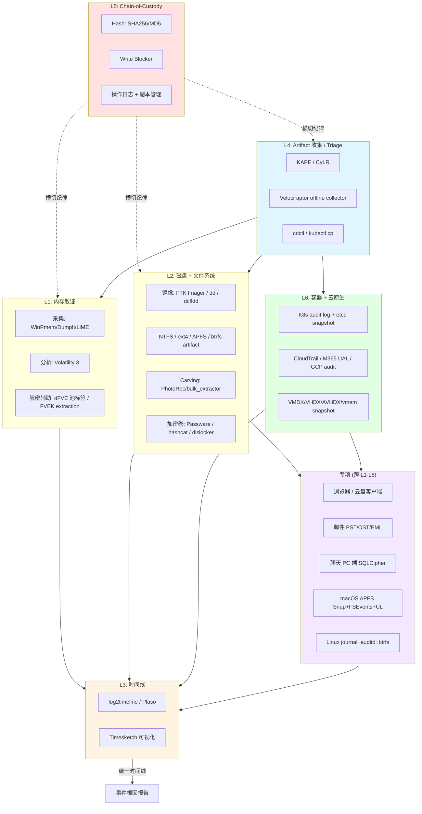

# 离线取证技术栈纵深：六层方法学 × 工具横评 × 专项深挖

> **读者画像**：国内大型互联网公司数据安全 / 取证工程师，关心"技术原理 + 能上手 + 能评估工具"。
> **场景边界**：**离线取证**视角（事件发生后基于磁盘镜像 / 内存镜像 / artifact 包 做事后分析与根因还原），**不**讨论实时 EDR / XDR 阻断、24/7 托管狩猎、移动端取证（Cellebrite / MSAB / GrayKey 不在本次范围）。
> **日期**：2026-05-13
> **修订记录**：v2 在原 `03-dfir-tech-stack.md` 骨架基础上，删除 EDR 替代视角与 "3 规模方案" 矩阵，新增 7 个离线取证专项（加密磁盘 / 虚拟化 / 浏览器与云盘 / 邮件 / 聊天 / macOS 深度 / Linux 深度）。

---

## 1. 执行摘要

离线取证的本质是**"先冷冻，再解剖，最后串故事"**。和实时 IR 的根本区别在于：实时 IR 关心 *"现在拦住攻击者"*（毫秒级动作、容忍误判），离线取证关心 *"过去发生了什么 + 证据能否复现"*（小时到周级周期、容忍不了任何不可逆操作）。**因此 EDR 视角不适用**——EDR 强在 telemetry pipeline + 内核阻断，离线取证强在 artifact 解析 + 时间线重建 + chain-of-custody，**两套工程哲学完全不同**。

工程视角分六层栈：**L1 内存 / L2 磁盘 + 文件系统 / L3 时间线 / L4 Artifact 收集 / L5 证据保全 / L6 容器云原生**。为什么是这 6 层（不是 4 / 8）：(a) 物理对象层面（内存、磁盘）必须独立；(b) 时间线是把任何单一证据"翻译成故事"的胶水，是所有分析者的工作台，必须独立；(c) Triage / artifact 收集是事件第一动作、独立工具栈（KAPE / Velociraptor offline collector），必须独立；(d) Chain-of-Custody 是横切纪律，但作为独立层强迫工程师不能省；(e) 云原生 / 容器把 L1-L4 大量工具失效（容器秒级销毁），必须单列。

**核心工具组合**（互联网公司离线取证最小可用栈）：
- **采集**：KAPE（Win triage）+ CyLR（跨平台 triage）+ Velociraptor offline collector（fleet 规模 triage）
- **镜像**：FTK Imager + dd/dcfldd + 软件 write blocker
- **内存**：WinPmem + LiME + Volatility 3
- **分析 GUI**：Autopsy 4.21+
- **时间线**：Plaso + Timesketch
- **加密磁盘**：Passware Kit Forensic（商业，必备）+ hashcat（自有算力跑字典）
- **沙箱辅助**：CAPEv2（动态分析样本）
- **流程**：DFIR-IRIS（IR case management）

**暂不投入**：EnCase / X-Ways（强司法定位、价格高，互联网公司内部调查 Autopsy + KAPE 够用）、GRR（社区被 Velociraptor 抢走、上手成本高、新项目不建议）、Rekall（社区基本停滞）。

---

## 2. 六层架构图（v2，已去 EDR 元素）



**离线取证关键数据流**：
- **入口永远是 L4**（在攻击者反应 / 自然衰减 / log rotation / 容器销毁前先把 artifact 冷冻）
- **L2 是主战场**（拿到 image 后 80% 时间花在文件系统 artifact 上）
- **L1 在内存马 / 凭据窃取 / rootkit 场景必走**
- **L3 是分析者的工作台**（任何复杂事件都要 super-timeline）
- **L5 是横切纪律**（任何动作前先 hash、走只读、记日志）
- **L6 是云原生分支**（容器短生命周期使 L1-L4 部分失效，必须靠 audit log 补齐）

---

## 3. Layer 1 — 内存取证（Memory Forensics）

### 3.1 技术原理
内存里有**磁盘上看不到的状态**：运行中的进程、网络连接、未落地的恶意代码、解密后的字符串、内存马（webshell / DLL injection / process hollowing）、API hook、rootkit hidden process、**以及 BitLocker / FileVault 的 FVEK / VMK**。物理内存按页（4KB / 大页 2MB / 1GB）组织，OS 维护 EPROCESS（Windows）/ task_struct（Linux）链表。取证工具本质是**绕过 OS 链表，直接扫描内存页中的 magic signature**，重建对象图。

### 3.2 工具对比

| 维度 | **Volatility 3** | **Rekall** |
|---|---|---|
| 架构 | 模块化（memory layer + symbol table + object template） | Volatility 2 fork，整合到 Google GRR |
| Profile | **Symbol table**（PDB 自动拉取） | 自动 profile 检测 |
| 实时分析 | 离线为主 | 可作为 library 跑 live system |
| 社区活跃度 | **活跃**（Volatility Foundation 主导） | **基本停滞** |
| 选型 | **首选**（10 年生态 + 最新 Win11 / Linux 5.x 内核支持） | 不推荐 |

来源：[Volatility 3 GitHub](https://github.com/volatilityfoundation/volatility3)、[Volatility 3 文档](https://volatility3.readthedocs.io/)。

**采集工具横评**：

| 工具 | 平台 | 输出格式 | 速度 | 关键特点 |
|---|---|---|---|---|
| [WinPmem](https://github.com/Velocidex/WinPmem) | Windows | raw / AFF4 | ~30s（16GB） | 原 Rekall 项目，现 Velocidex 维护，支持加密 AFF4 |
| [DumpIt (Comae/Magnet)](https://www.magnetforensics.com/resources/magnet-dumpit-for-windows/) | Windows | .dmp（crash dump） | 极快 | 单文件 zero-config，自动检测架构 |
| [LiME](https://github.com/504ensicsLabs/LiME) | Linux / Android | lime / raw / padded | 中 | LKM 形式插入，**需先编译匹配内核版本** |
| [AVML (Microsoft)](https://github.com/microsoft/avml) | Linux | LiME 格式 | 中 | 现代替代 LiME，**无需匹配内核 header**，预编译 binary 直接跑 |
| [OSXPmem (MacPmem)](https://github.com/google/macops-pmem) | macOS | AFF4 | 中 | **已停止维护**，macOS 13+ SIP 收紧后基本失效 |

### 3.3 实战 SOP — Windows 内存马排查
```cmd
# Step 1: 在感染主机以 Admin 权限采集
winpmem_v4.0.0.exe --format raw -o C:\temp\mem.raw

# Step 2: 立即 SHA256（L5 纪律）
certutil -hashfile C:\temp\mem.raw SHA256 > mem.raw.sha256

# Step 3: 拷到分析机跑 Volatility 3
vol -f mem.raw windows.pslist                          # 标准进程列表
vol -f mem.raw windows.psscan                          # 扫描 EPROCESS（含已退出/隐藏）
vol -f mem.raw windows.pstree                          # 树形看父子关系
vol -f mem.raw windows.malfind --dump                  # 找 RWX 内存页（典型注入）
vol -f mem.raw windows.netscan                         # 网络连接（找 C2）
vol -f mem.raw windows.cmdline                         # 进程命令行
vol -f mem.raw windows.dlllist --pid <PID>             # 找 unsigned / 异常路径 DLL
vol -f mem.raw windows.dumpfiles --pid <PID> -o ./out  # 落地后用 yara
```

来源：[Volatility 3 plugins 文档](https://volatility3.readthedocs.io/en/latest/volatility3.plugins.windows.html)。

**Java 内存马特别提示**：Java agent webshell（Behinder / Godzilla / suo5 派生）**不会触发 malfind 的 RWX 标记**（字节码在 JVM 已分配页内）。改用：(a) `jmap -dump:format=b,file=heap.hprof <pid>` 抓堆，(b) [arthas](https://arthas.aliyun.com/) `sc -d *Filter*` 在线列已加载 Filter / Servlet，(c) [java-memshell-scanner](https://github.com/c0ny1/java-memshell-scanner) 类型化扫描。

### 3.4 Gotcha
- **Win11 24H2 PDB 拉取**：Volatility 3 profile 自动生成偶尔卡在 Microsoft Symbol Server timeout，需 `--symbol-dirs` 离线指定。**生产建议内网架 PDB mirror**，避免现场无网络
- **DumpIt 的 .dmp 不是 raw**：先用 `windows.crashinfo` 确认 dump 格式，部分 plugin 直接解析 raw 失败
- **生产高压数据库**：30s 全量扫描会让 SQL Server / Redis 出现 latency spike，**生产 DB 主从切换后再采主节点**
- **LiME 内核版本不匹配** = 直接 panic，**新项目优先用 AVML**（微软维护，预编译 binary 跑遍 Ubuntu/RHEL/Debian 主流内核无需重编）

---

## 4. Layer 2 — 磁盘 + 文件系统取证

### 4.1 镜像取证流程
```
[源盘] → [Write Blocker (硬件 / RO mount)] → [bit-level imaging] → [hash 双副本] → [分析镜像]
```

**关键纪律**：
1. 绝不直接挂载源盘读写（NTFS 即使只读挂载也可能更新 USN journal）
2. 镜像后立即 SHA256，存档；分析过程中再次计算确认未变
3. 保留 ≥2 份镜像副本：1 份"金本"（不动）+ 1 份工作副本

### 4.2 工具横评

| 工具 | 类型 | 价格 | 优势 | 建议 |
|---|---|---|---|---|
| [FTK Imager](https://www.exterro.com/digital-forensics-software/ftk-imager) | 免费 imaging | $0 | de facto 免费 imager，输出 E01 / raw / AD1 | **必装** |
| [Autopsy 4.21+](https://www.autopsy.com/) | 开源 GUI | $0 | TSK 引擎，支持 NTFS/FAT/ext/APFS，插件生态活跃；4.21 起加 APFS 限制支持 + Cyber Triage 集成 | **首选 GUI** |
| [The Sleuth Kit](https://www.sleuthkit.org/) | 开源 CLI | $0 | Autopsy 底层，fls / icat / mmls / tsk_recover 灵活组合 | 脚本化批处理 |
| [EnCase](https://www.opentext.com/products/encase-forensic) | 商业 | $$$$ | E01 格式发明者，EnScript 自动化 | **互联网公司内部不需要** |
| [X-Ways Forensics](https://www.x-ways.net/forensics/) | 商业 | $$$ | 轻量、快，单机性能强 | 小团队商业替代 EnCase 选项 |

来源：[Autopsy 4.21 Release Notes](https://github.com/sleuthkit/autopsy/blob/autopsy-4.21.0/NEWS.txt)、[Sleuth Kit 官网](https://www.sleuthkit.org/)。

### 4.3 文件系统 Artifact 黄金清单

**NTFS（Windows）**：

| Artifact | 位置 | 用途 | 分析工具 |
|---|---|---|---|
| **$MFT** | 卷根 inode 0 | 所有文件 metadata（$SI + $FN 各 4 个 timestamp） | [MFTECmd](https://github.com/EricZimmerman/MFTECmd) |
| **$LogFile** | 卷根 inode 2 | NTFS 事务日志（极低层、噪音大） | [LogFileParser](https://github.com/jschicht/LogFileParser) |
| **$UsnJrnl:$J** | alternate stream | **高层 journal**——文件创建/删除/重命名 reason code | [MFTECmd](https://github.com/EricZimmerman/MFTECmd) |

来源：[DFIR Notes - MFT $LogFile $UsnJrnl 取证](https://mahmoud-shaker.gitbook.io/dfir-notes/master-file-table-mft-ntfs-usdlogfile-and-usdusnjrnl-forensics)、[NTFS USN Journal Forensic Insights](https://allenace.medium.com/forensic-insights-how-the-ntfs-usn-journal-j-reveals-system-activity-1e8afe4e337b)。

**Linux ext4 / XFS**：
- ext4 journal（inode 8）默认 `data=ordered` 模式**只记 metadata**，取证价值远低于 NTFS USN journal
- [FJTA (Forensic Journal Timeline Analyzer)](https://github.com/mnrkbys/fjta) 2025 年新出，**填补 TSK 不解析 ext4 journal 的空白**
- 生产 Linux 价值真正高的是 **auditd + systemd-journald**（详见 §11）

**APFS（macOS）**：见 §10 macOS 深度专项。

### 4.4 Carving 与文件恢复

```bash
# PhotoRec（480+ 格式签名，召回最高）
photorec /d output_dir disk.img

# bulk_extractor（不做 file，做 pattern：邮箱 / 信用卡 / URL / IP / hash）
bulk_extractor -o output_dir disk.img

# Scalpel（速度快，仓库基本停滞）
scalpel -o output_dir disk.img
```

来源：[PhotoRec/TestDisk](https://www.cgsecurity.org/wiki/PhotoRec)、[bulk_extractor (Simson Garfinkel)](https://github.com/simsong/bulk_extractor)。

### 4.5 Gotcha
- **NTFS resident files（<700B）直接存在 $MFT**——删除后只要 MFT entry 没复用就能完整恢复，**先看 $MFT 再 carving**
- **PhotoRec 对加密卷无能为力**（含 BitLocker / FileVault 卷内文件，必须先解密 → 见 §7）
- **Carving 永远不知道原文件名**——按签名重建，文件名靠 $MFT / 目录索引补回
- **Autopsy 4.21 APFS 支持有限**——不含加密卷 / 跨盘卷，加密 FileVault 卷必须先用 Passware / `apfs-fuse` + 已知密码挂载再喂给 Autopsy

---

## 5. Layer 3 — 时间线分析（Timeline）

### 5.1 Super-Timeline 核心思想
把 60+ 个数据源（MFT $SI/$FN、$UsnJrnl、event log、registry last-write、prefetch、shimcache、amcache、browser history、jumplist、LNK、SRUM、syslog、auth.log、bash_history、FSEvents、Unified Logs 等）**全部 normalize 成统一格式**，按时间戳排序，得到"这台机器发生过什么"的高分辨率电影。

### 5.2 工具栈
**Plaso (log2timeline)**：[GitHub](https://github.com/log2timeline/plaso)、[文档](https://plaso.readthedocs.io/)
- 引擎解析 250+ 种 artifact，输出 `.plaso`
- 三个 CLI：`log2timeline.py`（解析）/ `psort.py`（排序+过滤+输出）/ `psteal.py`（一键合并）

**Timesketch**：[GitHub](https://github.com/google/timesketch)、Web UI / Elasticsearch 后端 / 多人协作 / 内置 analyzer。

### 5.3 实战 SOP

```bash
# 简易：psteal 一键
psteal.py --source ./kape_output/ -o l2tcsv -w timeline.csv

# 推荐：2 步法
log2timeline.py --storage-file plaso.dump --parsers 'win7,!filestat' ./kape_output/
psort.py -o dynamic -w timeline.csv plaso.dump "date > '2026-05-01' AND date < '2026-05-13'"

# 导入 Timesketch
tsctl sketch create --name "case-2026-05-13"
tsctl sketch import --sketch-id 1 --timeline-name "host01" --file timeline.csv
```

来源：[Plaso log2timeline.py 用法](https://plaso.readthedocs.io/en/latest/sources/user/Using-log2timeline.html)、[psteal 用法](https://plaso.readthedocs.io/en/latest/sources/user/Using-psteal.html)。

### 5.4 Gotcha
- **别全 parser 跑**：默认 250+ parser 让 1TB 镜像跑 24h+，生产用 `--parsers win7` / `linux` / `macos` preset
- **MACB 时间戳不可信**：NTFS $SI（standard info）可被 `timestomp` 类工具篡改；**$FN（file name）更难篡改**，交叉验证用
- **时区**：Plaso 默认 UTC，但很多 artifact 自带本地时区，`--timezone` 一定要设对
- **Elastic 内存**：Timesketch 默认 ES heap 1GB，导入 1000 万 event OOM，提前调到 8GB+

---

## 6. Layer 4 — Artifact 收集（Triage Collection）

### 6.1 核心理念
事件爆发后**第一动作**：在攻击者反应 / 防御机制误杀证据 / 自然衰减（log rotation / 内存释放 / 容器重启）前，**先把易失 artifact 冷冻**。不深度分析，不"先看看再说"。

### 6.2 工具横评

| 工具 | 部署 | 强项 | 适用 |
|---|---|---|---|
| [**KAPE**](https://www.kroll.com/en/services/cyber/incident-response-recovery/kroll-artifact-parser-and-extractor-kape) | 单机 CLI（Eric Zimmerman） | **Windows triage 业界标杆**；Targets + Modules 双层抽象；KapeFiles 社区库 | Windows 离线 triage |
| [**CyLR**](https://github.com/orlikoski/CyLR) | 单机 CLI（C#） | 跨平台 Win/Linux/macOS，比 KAPE 轻 | 跨平台快速 triage |
| [**Velociraptor offline collector**](https://docs.velociraptor.app/docs/deployment/offline_collections/) | server 生成自包含 exe/elf | **完全离线**：拷贝运行后产 zip 包，无需 agent | fleet 规模 triage / 不能部署 agent 的环境 |
| [**UAC (Unix-like Artifact Collector)**](https://github.com/tclahr/uac) | shell 脚本 | 跨 Linux / AIX / Solaris / macOS / *BSD | Unix 类系统快速 triage |

### 6.3 KAPE 必收 Windows artifact 清单（`!SANS_Triage` compound target）

| 类别 | Artifact | 说明 |
|---|---|---|
| 执行证据 | **Prefetch** `C:\Windows\Prefetch\*.pf` | 程序首次运行时间 + 次数 |
| 执行证据 | **AmCache** `C:\Windows\AppCompat\Programs\Amcache.hve` | 安装程序 + SHA1 hash |
| 执行证据 | **ShimCache** `SYSTEM\CurrentControlSet\Control\Session Manager\AppCompatCache` | 最近运行程序快照 |
| 执行证据 | **SRUM** `C:\Windows\System32\sru\SRUDB.dat` | 系统资源使用（程序 + 网络 byte count） |
| 用户活动 | **Jump Lists** `%APPDATA%\Microsoft\Windows\Recent\AutomaticDestinations\` | 最近访问文件 |
| 用户活动 | **LNK** `%APPDATA%\Microsoft\Windows\Recent\*.lnk` | shortcut 揭示原始路径 |
| 用户活动 | **Browser history** Chrome/Edge/Firefox SQLite | 浏览/下载历史 |
| 系统状态 | **Event logs** `C:\Windows\System32\winevt\Logs\` | Security / System / PowerShell |
| 系统状态 | **Registry hives** SYSTEM/SOFTWARE/SAM/NTUSER.DAT | 持久化 / 配置 / 凭据 hash |
| 文件系统 | **$MFT / $LogFile / $UsnJrnl** | NTFS 元数据三件套 |

来源：[Windows Artifact Series (Medium)](https://upadhyayraj.medium.com/windows-artifact-series-amcache-shimcache-prefetch-lnkfiles-jumplist-shellbags-b9bd3dce5c4a)、[ShimCache vs AmCache (Magnet Forensics)](https://www.magnetforensics.com/blog/shimcache-vs-amcache-key-windows-forensic-artifacts/)、[KAPE !SANS_Triage 配置](https://github.com/EricZimmerman/KapeFiles/blob/master/Targets/Compound/!SANS_Triage.tkape)。

### 6.4 KAPE 工作流

```cmd
# 现场 triage
kape.exe --tsource F: --target !SANS_Triage --tdest C:\kape_out\%COMPUTERNAME% --tflush

# 分析机解析阶段（不在现场）
kape.exe --msource C:\kape_out\HOST01 --module !EZParser --mdest C:\kape_parsed\HOST01

# PowerShell remoting 远程
Invoke-Command -ComputerName HOST01 -ScriptBlock {
  & \\fs\share\kape\kape.exe --tsource C: --target !SANS_Triage --tdest \\fs\share\kape_out\$env:COMPUTERNAME --tflush
}
```

### 6.5 Velociraptor offline collector（fleet 规模替代 KAPE）

server 端生成自包含 `.exe` / `.elf`，拷贝目标机跑后产 zip artifact 包，**完全离线**、不需要 agent。VQL 语法可自定义采集：

```sql
-- 自定义离线 collector：抓 Windows artifact + 内存
SELECT * FROM Artifact.Windows.KapeFiles.Targets(_SANS_Triage=Y)
```

来源：[Velociraptor Offline Collectors](https://docs.velociraptor.app/docs/deployment/offline_collections/)、[Velociraptor 文档](https://docs.velociraptor.app/)。

### 6.6 Gotcha
- **KAPE EULA**：免费但**禁止商业再分发**——互联网公司大规模内部部署前需法务确认（自用 OK，做成产品打包给客户禁止）
- **KAPE 默认 copy 模式**——大量小文件 IO 慢，加 `--zip` 输出 zip 而非散文件
- **Triage 不是 imaging**——只抓"selected artifact"，磁盘上还有 99% 没碰，深度分析仍需完整 imaging
- **Velociraptor 反向被利用**：2025 年起多起攻击者把 Velociraptor 当 C2 隧道（[Sophos 分析](https://www.sophos.com/en-us/blog/velociraptor-incident-response-tool-abused-for-remote-access)、[The Hacker News](https://thehackernews.com/2025/08/attackers-abuse-velociraptor-forensic.html)），自建时**监控自己环境内非授权 Velociraptor 二进制**

---

## 7. Layer 5 — 证据保全 / Chain-of-Custody

### 7.1 企业视角 vs 司法视角
作为互联网公司 SecOps，目标不是把证据交法院，而是**保证内部调查结论可追溯、可复现、可质疑**。但司法纪律拿来用依然降低风险——尤其涉及**内鬼 / 数据泄露 / 可能演变成员工纠纷**时。

### 7.2 工程纪律清单

| 维度 | 实践 |
|---|---|
| 采集者身份 | 账号 / 工号 / 时间签字 |
| 采集时间 | 每个 artifact 文件加 UTC 时戳前缀 |
| 采集方法 | 命令落 `script` 或 PowerShell `Start-Transcript` |
| 哈希 | 采集后**立即** SHA256，独立位置存档；分析过程任意时点可验 |
| 存储隔离 | 证据放独立 share / bucket，白名单访问 |
| 访问审计 | 每次访问证据落日志 |
| 副本 | ≥1 份冷备 + 1 份工作副本，不在工作副本上做不可逆操作 |

### 7.3 Write Blocker

**硬件**：[OpenText / Tableau Forensic Bridges](https://www.opentext.com/products/tableau-forensic)，物理层强制只读，**最高可信度**。互联网公司场景一般不上——内部调查时间线急、物理走单太重，只在 HR / 法务介入的高敏感场景。

**软件**：
- Windows：注册表禁用自动挂载，或 OSFMount / Arsenal Image Mounter 只读模式
- Linux：`mount -o ro,noload,nodev,nosuid` + losetup `-r`（loop device 强制只读）
- macOS：磁盘工具勾"只读"，或 `hdiutil attach -readonly`

### 7.4 Gotcha
- **NTFS 即使只读挂载也会更新 $UsnJrnl**——Linux 默认 ntfs-3g 挂载会写 metadata，必须 `-o ro,noload`
- **Windows ReadyBoost / Search 索引会自动碰盘**——分析机要全禁
- **杀毒会自动扫 disk image** → 部分 malware 被隔离改名，分析机一定要禁 AV

---

## 8. Layer 6 — 容器 + 云原生取证（缩短版）

### 8.1 容器取证 vs 传统：根本差异

| 维度 | 传统主机 | 容器 / K8s |
|---|---|---|
| **生命周期** | 月/年 | **秒/分钟**（攻击者退出 = 容器销毁 = 内存/文件全消失） |
| **镜像** | 一次安装长期演进 | 不可变镜像 + ephemeral fs |
| **可见性入口** | 主机 audit/event log | **orchestrator log（K8s audit / etcd）是关键证据** |

来源：[K8s Forensic Container Analysis 官方博客](https://kubernetes.io/blog/2023/03/10/forensic-container-analysis/)、[Sysdig K8s DFIR Guide](https://www.sysdig.com/blog/guide-kubernetes-forensics-dfir)、[Google Cloud Container Forensics Best Practices](https://cloud.google.com/blog/products/containers-kubernetes/best-practices-for-performing-forensics-on-containers)。

### 8.2 K8s 离线取证 SOP

```bash
# Step 1: 冻结 pod
kubectl cordon <node>                                   # 阻止新 pod 调度
# 不要 drain！drain 会驱逐疑似 pod 销毁证据

# Step 2: quarantine label
kubectl label pod <pod> quarantine=true --overwrite

# Step 3: dump 容器
sudo crictl inspect <container_id> > container-inspect.json
sudo crictl pause <container_id>                        # 暂停（保留内存）

# Step 4: K8s 1.25+ Forensic Container Checkpointing
curl -sk -X POST "https://<NODE_IP>:10250/checkpoint/default/<POD>/<CONTAINER>" \
  --cert apiserver-client.crt --key apiserver-client.key

# Step 5: 节点级 artifact（Linux 跑 CyLR / UAC）
# Step 6: 集群级证据
kubectl get events --all-namespaces --sort-by='.lastTimestamp' > events.log
ETCDCTL_API=3 etcdctl snapshot save snapshot.db --endpoints=https://127.0.0.1:2379 \
  --cert=server.crt --key=server.key --cacert=ca.crt
```

### 8.3 云厂商离线取证关键 log

| 平台 | 关键 log | 角色 |
|---|---|---|
| AWS | **CloudTrail** + EBS snapshot | API 全量审计 + 磁盘快照（取证镜像源） |
| GCP | **Cloud Audit Logs** + Persistent Disk snapshot | API + 磁盘快照 |
| Azure | **Activity Log** + Diagnostic Settings + Managed Disk snapshot | API + 资源级审计 |
| **M365 / Entra ID** | **Unified Audit Log (UAL)** + Mailbox audit | 跨服务统一审计，邮箱级访问 |

来源：[SANS FOR509 Enterprise Cloud Forensics](https://www.sans.org/cyber-security-courses/enterprise-cloud-forensics-incident-response)、[Sygnia Cloud IR Best Practices (AWS/Azure/GCP)](https://www.sygnia.co/blog/incident-response-to-cloud-security-incidents-aws-azure-and-gcp-best-practices/)、[M365 UAL 取证 (Medium)](https://medium.com/@seantsv/the-cloud-sleuth-extracting-forensic-artifacts-from-m365-ual-ea9b7aef9f90)、[Office-365-Extractor (PwC-IR)](https://github.com/PwC-IR/Office-365-Extractor)。

### 8.4 Gotcha
- **K8s audit log 默认 off**：apiserver 启动必须 `--audit-policy-file` + `--audit-log-path`
- **etcd 快照含全部 secret 明文**（除非 EncryptionConfiguration），快照本身必须当机密
- **CloudTrail Data Events 默认不开**（只开 Management Events）——S3 / Lambda 对象级调用要单独打开
- **M365 UAL 默认保留 90/180 天**（E3/E5 不同），数据出境前必须先 export

---

## 9. 专项一：加密磁盘取证（BitLocker / FileVault / LUKS / VeraCrypt）

加密卷是离线取证的**第一道大墙**。心智模型：**密码学不可破，但工程漏洞可绕**——绕过路径有 4 条：(a) 内存里抓 FVEK / VMK，(b) hibernation file / pagefile 残留密钥，(c) 弱口令字典爆破，(d) 已知 recovery key（来自 AD / Azure / iCloud / MDM）。**永远先试 a/d，再考虑 c**。

| 卷类型 | 密钥位置 | 推荐解密路径 | 工具 |
|---|---|---|---|
| **BitLocker** | LSASS / dumpfve.sys (Windows 11 `dFVE` pool tag) / hibernation | 内存 dump → FVEK extraction → 解密 | [Passware Kit](https://blog.elcomsoft.com/2022/05/live-system-analysis-extracting-bitlocker-keys/)、[volatility-bitlocker plugin (elceef)](https://github.com/elceef/bitlocker)、[MemProcFS](https://www.linkedin.com/pulse/bitlocker-full-volume-encryption-key-recovery-jiri-holoska)、[dislocker](https://github.com/Aorimn/dislocker) |
| **FileVault 2 / APFS** | macOS keychain / memory / iCloud recovery | Passware Bootable Memory Imager → 内存抓 key + APFS hash 离线爆破（hashcat -m 18300） | [Passware Kit](https://blog.passware.com/from-filevault-to-t2-how-to-deal-with-native-apple-encryption/)、[apfs2hashcat](https://github.com/Banaanhangwagen/apfs2hashcat) |
| **LUKS / LUKS2** | header 含 PBKDF2 hash | 提取 header → hashcat / JtR 字典爆破 | `cryptsetup luksHeaderBackup` → hashcat -m 14600（LUKS1）/ [grond.sh](https://gist.github.com/micxer/63b49e09558904dd64ef78400c6b9517)（LUKS2） |
| **VeraCrypt** | volume header 含 hash | 提取 header → hashcat | hashcat -m 13721/13722（modes 区分 hash 算法） |

**关键命令**：
```bash
# BitLocker FVEK 抓取（dislocker，用 recovery key 解密）
dislocker -V /dev/sdb1 -p<RECOVERY_KEY> -- /mnt/decrypted

# LUKS1 hashcat 路径
cryptsetup luksHeaderBackup /dev/sdc1 --header-backup-file luks-hdr.bin
hashcat -m 14600 -a 0 luks-hdr.bin wordlist.txt

# APFS hashcat（先用 apfs2hashcat 提 hash）
python apfs2hashcat.py apfs.img > apfs.hash
hashcat -m 18300 apfs.hash wordlist.txt
```

来源：[Bruteforcing LUKS (Forensic Focus)](https://www.forensicfocus.com/articles/bruteforcing-linux-full-disk-encryption-luks-with-hashcat/)、[Cracking LUKS passphrases (Diverto)](https://diverto.github.io/2019/11/18/Cracking-LUKS-passphrases)、[LUKS hidden volumes (iBlue Team)](https://www.iblue.team/linux-forensics/luks-hashcat-and-hidden-volumes)、[apfs2hashcat](https://github.com/Banaanhangwagen/apfs2hashcat)、[Elcomsoft Forensic Disk Decryptor](https://www.elcomsoft.com/efdd.html)。

**Gotcha**：
- **Windows 11 24H2 BitLocker key 位置变了**：以前在 LSASS，现在主要在 `dumpfve.sys` 分配的 `dFVE` pool tag 区域；老版 Volatility plugin 找不到 → 必须升级到 elceef 维护版本
- **TPM-only protector**（无 PIN）= 攻击者偷物理机后**重启直接解密**：取证侧反向利用——攻击者已经做过此事的话，你也可以做。但代价是**销毁原状**（首次启动后磁盘 metadata 会更新），违反 §7 chain-of-custody，**只在没有其他路径时用**
- **LUKS2 hashcat 不支持**：hashcat / JtR 只支持 LUKS1（mode 14600），LUKS2 必须 cryptsetup 脚本爆破（grond.sh），速度差 1-2 个量级

---

## 10. 专项二：虚拟化 / VM 镜像取证

VM 取证有两条独立路径：**(a) 从 hypervisor 直接拿 vDisk + vMem 文件**（如 ESXi `.vmdk` + `.vmem`），**(b) 从 guest OS 内做传统取证**。优先 (a)——**hypervisor 视角是 god mode，guest 检测不到、不污染**。

| 格式 | 来源 | 取证工具 | 备注 |
|---|---|---|---|
| **VMDK**（含 sparse / flat / delta） | VMware Workstation / ESXi | [libvmdk](https://github.com/libyal/libvmdk)、FTK Imager、Autopsy、X-Ways；vmware-vdiskmanager 合并 delta | ESXi 多 delta 文件需**按 last modified 时间顺序**导入分析工具 |
| **VHD / VHDX** | Hyper-V | OSFMount、FTK Imager、PowerShell `Mount-DiskImage`；`Merge-VHD` 合并差分盘 | VHDX 比 VHD 抗损坏更好（4KB 扇区 + log），但**差分链未合并**则单文件不可读 |
| **AVHDX** | Hyper-V checkpoint 差分盘 | 必须配套父 VHDX 合并才能读，`Merge-VHD` 或 Hyper-V Manager | **孤儿 AVHDX**（父盘已删/checkpoint 丢失）= 数据基本不可恢复，[DataCare Labs 文章](https://www.datacarelabs.com/blog/forensic-recovery-vmdk-vhdx-hypervisor-failure/) 提供手动 link 思路 |
| **vmem / vmss / vmsn** | VMware suspend / snapshot | **Volatility 3 直接喂 .vmem**（[VMware Security Blog](https://blogs.vmware.com/security/2021/03/memory-forensics-for-virtualized-hosts.html)） | VM suspend 是**取证侧最优解**——一行 `vmware-cmd suspend` 拿到完整内存 dump 等价 |
| **OVA / OVF** | 跨 hypervisor 导出 | `tar -xf` 解开 OVA → 内含 vmdk + manifest（含 SHA256） | manifest 可验完整性 |

**实战 SOP — ESXi 取证**：
```bash
# 在 ESXi shell（启用 SSH 后）
vim-cmd vmsvc/getallvms                                 # 列所有 VM
vim-cmd vmsvc/snapshot.create <vmid> "forensic-snap"    # 创建 snapshot（含内存）
# snapshot 产生 .vmsn（VM state）+ .vmem（memory）+ -delta.vmdk

# 复制到取证机
scp /vmfs/volumes/datastore1/vm1/*.vmdk forensic-host:/data/case/
# 合并 delta（在取证机）
vmware-vdiskmanager -r base-flat.vmdk -t 0 base-merged.vmdk
# 喂给 Autopsy / Volatility
```

来源：[SANS - Digital Forensic Imaging in VMware ESXi](https://www.sans.org/blog/how-to-digital-forensic-imaging-in-vmware-esxi)、[Forensic Acquisition and Analysis of VMware Virtual Hard Disks (RIT)](https://repository.rit.edu/cgi/viewcontent.cgi?article=1300&context=other)、[Memory Forensics for Virtualized Hosts (VMware Blog)](https://blogs.vmware.com/security/2021/03/memory-forensics-for-virtualized-hosts.html)、[4n6k - Merging VMDKs & Delta/Snapshot Files](https://www.4n6k.com/2014/04/forensics-quickie-merging-vmdks.html)、[Microsoft Learn - Hyper-V snapshots/checkpoints/AVHDX](https://learn.microsoft.com/en-us/troubleshoot/windows-server/virtualization/hyper-v-snapshots-checkpoints-differencing-disks)。

**Gotcha**：
- **vCenter Live Migration trace 在 vpxd.log**：跨 ESXi 主机迁移的 VM 取证要拉源 / 目标两端 vpxd.log 串时间线
- **AVHDX 链断了 = 数据基本死亡**：Hyper-V checkpoint **取证侧绝对禁止 delete**（会触发 merge），只读 copy
- **vmware-vdiskmanager 合并是不可逆的**——永远在**副本**上做合并，金本不动

---

## 11. 专项三：浏览器 + 云存储客户端取证

### 11.1 浏览器（Chrome / Edge / Firefox）

现代浏览器主要数据存 SQLite + JSON。Chrome / Edge / Brave / Opera 共用 Chromium 内核，artifact 结构高度一致。

| Artifact | 路径（Chrome 为例） | 内容 |
|---|---|---|
| **History** | `%LocalAppData%\Google\Chrome\User Data\Default\History` | URL / visit / download / keyword search |
| **Cookies** | `...\Default\Network\Cookies` | DPAPI 加密（Win10+） |
| **Login Data** | `...\Default\Login Data` | 保存的密码，DPAPI 加密 |
| **Web Data** | `...\Default\Web Data` | autofill / payment |
| **Top Sites** | `...\Default\Top Sites` | 新标签页推荐 |
| **Sessions / Tabs** | `...\Default\Sessions\Session_*`、`Tabs_*` | 最近会话 / 标签（**hindsight 专长**） |

**推荐工具**：
- [**Hindsight**](https://github.com/obsidianforensics/hindsight) — Python，专攻 Chromium 系，能解 Current Session / Last Tabs 等冷门 artifact
- [**forensic-webhistory**](https://github.com/acquiredsecurity/forensic-webhistory) — 跨浏览器（Chrome/Firefox/Edge/Brave/Opera/Vivaldi）统一时间线
- DB Browser for SQLite — 手动看库

**Firefox 关键库**：`places.sqlite`（history+bookmarks）/ `cookies.sqlite` / `formhistory.sqlite` / `logins.json` + `key4.db`（密码，AES-256-GCM）

来源：[Hindsight GitHub](https://github.com/obsidianforensics/hindsight)、[Browser Forensics Cheatsheet (Medium)](https://medium.com/@Khalil.Z/web-browser-forensics-cheatsheet-a-practical-guide-for-dfir-soc-analysts-2ad38bbe9ca5)、[Advancing Web Browser Forensics 2025 综述](https://link.springer.com/article/10.1007/s42979-025-03921-6)。

**Gotcha**：
- **Chrome 内核**热数据库会被锁——必须**关闭浏览器或 copy 整库**再分析
- **Chrome 80+ Cookies / Login Data 用 DPAPI + AES-GCM 双层加密**——需要从同主机 Local State 拿 master key，离线无 user DPAPI key 时**解不出**（除非顺便拿了 user 的 SID + 密码 / hash）

### 11.2 云存储客户端

| 客户端 | 关键 artifact 位置 | 备注 |
|---|---|---|
| **OneDrive** | `NTUSER\Software\Microsoft\OneDrive\Accounts\Personal\Tenants` + `%LocalAppData%\Microsoft\OneDrive\settings\` | tenant 信息、同步状态、最近文件 |
| **Google Drive** | `%LocalAppData%\Google\DriveFS\` 或老版 `sync_config.db` | 账号 email + 同步路径 |
| **Dropbox** | `%AppData%\Dropbox\info.json` + `instance1\config.dbx`（DPAPI 加密） | 加密 dbx 数据库存 sync 元数据 |
| **百度网盘 / 阿里云盘**（国内） | `%AppData%\baidunetdisk\` / `%AppData%\Aliyundrive\` | 中文路径 + 上传/下载日志，需个案分析 |

来源：[OneDrive Forensics (CyberEngage)](https://www.cyberengage.org/post/2-onedrive-forensics-investigating-cloud-storage-on-windows-systems)、[Mastering Cloud Storage Forensics (Medium)](https://medium.com/@cyberengage.org/mastering-cloud-storage-forensics-google-drive-onedrive-dropbox-box-investigation-techniques-0cbe02cf5bad)、[Local Cloud Storage (HackTricks)](https://book.hacktricks.wiki/en/generic-methodologies-and-resources/basic-forensic-methodology/specific-software-file-type-tricks/local-cloud-storage.html)。

**Gotcha**：
- **OneDrive 文件占位符（Files On-Demand）** 磁盘上看着是文件但实际没下载——只有 reparse point，**取证侧需先强制同步全部内容再镜像**
- **Dropbox DPAPI 加密 dbx** 必须在 user 上下文解，离线分析机要么用 [DPAPIck](https://www.dpapick.com/) 配合 user master key 解密，要么 live 在感染机解后 export

---

## 12. 专项四：邮件取证（PST / OST / EML / M365）

| 格式 | 来源 | 解析工具 | 备注 |
|---|---|---|---|
| **PST** | Outlook 本地存档 | [libpff/pffexport](https://github.com/libyal/libpff)、Autopsy、Aid4Mail、MailXaminer | 开源 libpff 可批量 export 到 EML + 抽 attachment |
| **OST** | Outlook 缓存（链接 Exchange / M365） | libpff（部分支持）、Kernel OST Viewer、Aid4Mail | M365 模式下 OST 可达 50GB，含最近 12 月数据 |
| **NST** | M365 Outlook Groups | MailXaminer | 较新格式，工具支持有限 |
| **EML / MBOX** | 通用导出 | 任意文本编辑器 / [emlAnalyzer](https://github.com/wahlflo/eml_analyzer) / Aid4Mail | header 链路追踪 + IOC 提取 |
| **EDB** | Exchange 服务器 store | EseDbViewer、Kernel EDB | 服务器侧取证 |

**M365 / Exchange Online**：
- **eDiscovery Standard / Premium**（Purview 门户）：search → hold → export PST → 链式分析
- **Unified Audit Log (UAL)**：跨服务统一审计，**默认 90/180 天**保留（E3/E5），含 mailbox access / file access / admin action，[Office-365-Extractor (PwC-IR)](https://github.com/PwC-IR/Office-365-Extractor) 是开源 UAL 完整抓取工具
- **Mailbox Audit Log**：单独控制（per-mailbox 启用），含 Send/HardDelete/MoveToDeletedItems 等敏感动作

来源：[Microsoft Purview eDiscovery](https://learn.microsoft.com/en-us/purview/edisc)、[Exchange Online eDiscovery PST export](https://learn.microsoft.com/en-us/exchange/policy-and-compliance/ediscovery/export-results-to-pst)、[libpff GitHub](https://github.com/libyal/libpff)、[Office-365-Extractor](https://github.com/PwC-IR/Office-365-Extractor)、[M365 UAL Forensic Artifacts (Medium)](https://medium.com/@seantsv/the-cloud-sleuth-extracting-forensic-artifacts-from-m365-ual-ea9b7aef9f90)。

**Gotcha**：
- **PST 文件被 Outlook 进程独占**——取证前**关闭 Outlook**，或对 OST 操作时改用 VSS snapshot
- **M365 UAL 默认 90 天**，事件晚发现就丢——日常应**配 Continuous Export 到自建 SIEM**，不要依赖 portal
- **UnifiedAuditLogFirstOptInDate** 早于事件日期才有意义；很多公司直到事件后才开 UAL，等于事前是黑洞

---

## 13. 专项五：电脑端聊天记录取证

### 13.1 微信 PC 版（4.0+，SQLCipher 4）

微信 4.0（2025 起）大改加密：从老版 SQLCipher 1/3 升级到 **SQLCipher 4**（AES-256-CBC + PBKDF2-HMAC-SHA512 + 256K iterations，由腾讯自研 [WCDB](https://github.com/Tencent/wcdb) 封装）。**纯密码学不可破**，但工程上可绕：

| 解密路径 | 说明 | 工具 |
|---|---|---|
| **从内存抓 raw key** | WCDB 在 process 内存里缓存原始 key（`x'<64hex>_<32hex_salt>'` 格式），匹配模式 + HMAC 校验 page 1 验证 key | [wechat-decrypt (ylytdeng)](https://github.com/ylytdeng/wechat-decrypt)（Win/Linux/macOS）、[wdecipher (gndlwch2w)](https://github.com/gndlwch2w/wdecipher)、[wechat-cli (huohuoer)](https://github.com/huohuoer/wechat-cli) |
| **老版 EnMicroMsg.db**（手机端 / 老 PC） | key = MD5(IMEI + uin)[0:7]，已被研究透彻 | 大量 GitHub 工具 |
| **DAT 图片** | 微信 4.0（2025-08+）.dat 文件用 **AES-128-ECB + XOR hybrid (V2)** | 各 wechat-decrypt 工具都支持 |

数据库结构（4.0）：`session/session.db`（会话列表）、`message/message_*.db`（聊天记录，分库存）、`contact/contact.db`、`media_*/media_*.db`（约 26 个库）。

来源：[wechat-decrypt (WeChat 4.0)](https://github.com/ylytdeng/wechat-decrypt)、[Forensic Analysis of wxSQLite3-Encrypted Databases (MDPI 2024)](https://www.mdpi.com/2079-9292/13/7/1325)、[WeChat Forensics (Belkasoft)](https://belkasoft.com/WeChat-forensics)、[Decrypting WeChat Messages Without Physical Possession (Nisos)](https://nisos.com/blog/decrypting-wechat-messages/)。

### 13.2 Telegram Desktop

- 数据库位置 Win：`%AppData%\Telegram Desktop\tdata\`，目录里有 `key_data` + 多个 `D877F783D5D3EF8C\map*` 子目录
- 本地加密较强，**主路径是抓内存**——[Extraction of Telegram Desktop memory artifacts (ScienceDirect 2022)](https://www.sciencedirect.com/science/article/pii/S2666281722000117) 详细方法学
- 工具：[telegram-desktop-decrypt (lab52)](https://github.com/lab52io/TelegramDesktop-Decrypt)（已 stale 但思路可借鉴）

### 13.3 Slack / Discord / Teams Desktop

- **Electron 应用通病**：本地存 LevelDB / IndexedDB（Chrome 内核），位置 `%AppData%\<app>\IndexedDB\` 或 `Local Storage\`
- token 一般在 `Local Storage` 或 keychain（DPAPI / macOS keychain）
- 工具偏少，常用思路：**直接复制目录 → 在分析机重启同款 client（指向只读 mount）→ UI 浏览** 或用 [ChromHist / leveldb-cli](https://github.com/google/leveldb) 解 LevelDB

### 13.4 钉钉 / 飞书 / 企微 PC

国内 IM PC 客户端取证文献稀少，**实践上以"日志 + 落地文件 + 进程内存"为主**：
- 日志路径常为 `%AppData%\DingTalk\`、`%AppData%\Lark\sdk-storage\`、`%AppData%\WXWork\`
- 加密强度参差不齐——钉钉 PC 老版本 SQLite 弱加密；企微 / 飞书较新版本走 SQLCipher
- **企业内部场景**：通过企业管理后台直接 export 会话审计 log（远比 PC 端 reverse 简单）

**Gotcha**：
- **WeChat / Telegram 抓内存需 admin + WeChat 进程在跑**——电脑取证时如果 WeChat 已关，需重新登录解锁本地库后才能抓 key
- **离线 image 无法直接解 WeChat 4.0**（key 只在内存）——必须 **live 抓 key + 离线 image 喂 key 解密** 两步走

---

## 14. 专项六：macOS 深度取证

macOS 取证的 **3 张王牌**：APFS Snapshot / FSEvents / Unified Logs。和 Windows artifact 体量相当，但**工具生态更小**。

### 14.1 APFS Snapshots — macOS 取证第一站

- Time Machine **本地 snapshot** 即使没插外置盘也会自动建（OS 升级、磁盘活跃时刻）
- 即使攻击者删了痕迹，snapshot 里**可能完整保留**
- 命令：`tmutil listlocalsnapshots /`、`diskutil apfs listSnapshots /`、`mount_apfs -s <snap> /dev/diskXs1 /Volumes/snap_ro -o ro`

### 14.2 FSEvents — 文件系统事件日志

- 位置 `/.fseventsd/`（每个 APFS 卷一份）
- 记录 file create / modify / rename / delete 等事件
- **缺陷**：不存 per-event timestamp，只能用 gzip 文件的 created/modified 推估
- 工具：[FSEventsParser (G-C-Partners)](https://github.com/dlcowen/FSEventsParser)、[mac_apt](https://github.com/ydkhatri/mac_apt)

### 14.3 Unified Logs — 替代 syslog 的统一日志

- macOS 10.12+ 引入，默认 always-on，**远比老 syslog 信息丰富**
- 采集：`log collect --output system.logarchive`（**必须在 macOS 上跑**，logarchive 二进制格式离开 macOS 难解析）
- 查询：`log show --predicate '...' --info --debug`
- 工具：[UnifiedLogReader (mandiant)](https://github.com/mandiant/macos-UnifiedLogs)（Rust 实现，可在 Linux/Win 解 logarchive）、[ElcomSoft Apple sysdiagnose 2025 分析](https://blog.elcomsoft.com/2025/06/extracting-and-analyzing-apple-unified-logs/)

### 14.4 其他关键 artifact

| Artifact | 位置 | 用途 |
|---|---|---|
| **TCC.db** | `~/Library/Application Support/com.apple.TCC/TCC.db` | 隐私权限访问记录（哪个 app 何时访问相机 / 麦克风 / 文件） |
| **KnowledgeC.db** | `~/Library/Application Support/Knowledge/knowledgeC.db` | 用户活动（app usage / device events / Siri） |
| **Quarantine** | `~/Library/Preferences/com.apple.LaunchServices.QuarantineEventsV2` | 下载来源 URL（macOS Gatekeeper 钩子） |
| **Spotlight metadata** | `.Spotlight-V100/Store-V2/store.db` | 文件 metadata 索引 |
| **bash_history / zsh_history** | `~/.bash_history` / `~/.zsh_history` | shell 命令历史 |

来源：[Apples to Apples - macOS Forensics (Mathias Fuchs)](https://medium.com/@mathias.fuchs/apples-to-apples-why-macos-forensics-can-be-easier-than-windows-19c9f234c1a1)、[7 Essential macOS Artifacts (Magnet Forensics)](https://www.magnetforensics.com/blog/essential-artifacts-for-macos-forensics/)、[Mac-Triage tool (a1l4m)](https://github.com/a1l4m/Mac-Triage)、[FSEvents (Hexordia)](https://www.hexordia.com/blog/mac-forensics-analysis)、[SANS FOR518 Mac & iOS Forensics](https://www.sans.org/cyber-security-courses/mac-ios-forensic-analysis-incident-response)。

**Apple Silicon Secure Enclave**：M1/M2/M3/M4 芯片的 Secure Enclave 持有 FileVault Volume Key、Touch ID hash、Apple Pay key。**取证侧无法绕过 SE**——必须有：(a) 用户密码 / Touch ID / Face ID，或 (b) iCloud / MDM 派发的 recovery key，或 (c) 利用 SE 历史漏洞（极少且需特定固件）。**Apple Silicon Mac 没有现成的 hashcat 路径**——是离线取证最难的目标之一，企业内部调查需优先走 MDM 强制重置 / 用户配合。

**Gotcha**：
- **System Integrity Protection (SIP)** 阻止外部工具读 `/System` 下文件——目标机 live 取证前需 `csrutil disable`（需重启 Recovery，**有意 leave trace**），或在外接磁盘单盘启动模式做
- **macOS 13+ 内核签名收紧** → OSXPmem / MacPmem 在新版基本失效，**内存取证只能靠 Apple sysdiagnose + Unified Logs + 第三方 LogarchiveReader**

---

## 15. 专项七：Linux 桌面 / 服务器深度取证

Linux artifact 生态比 Windows / macOS 弱，**工具靠组合**（cat + jq + 脚本）。**生产 Linux 真正高价值的不是文件系统 artifact，而是 systemd-journald + auditd 两条日志线**——这是和 Windows event log 等价的对象。

### 15.1 systemd-journald

- 位置：`/var/log/journal/<machine-id>/` 二进制文件 + `/run/log/journal/`（易失）
- **持久化**：默认很多 distro 用易失存储——`/etc/systemd/journald.conf` 设 `Storage=persistent` 才存盘
- 命令：
  ```bash
  journalctl --output=json --since "2026-05-01" > journal.ndjson
  journalctl _UID=1000 --output=verbose                # 按 UID 过滤
  journalctl _SYSTEMD_UNIT=ssh.service                 # 按 service
  journalctl --output=export > journal.dump            # 二进制导出（保留所有字段）
  ```
- 工具：[FOR577 SANS course](https://www.sans.org/cyber-security-courses/linux-threat-hunting-incident-response) 覆盖、[Forensic Analysis of Linux Journals (Abhiram 2023)](https://stuxnet999.github.io/dfir/linux-journal-forensics/)

来源：[Linux Forensics Logs (DFIR Notes)](https://mahmoud-shaker.gitbook.io/dfir-notes/linux-forensics/linux-forensics-logs)。

### 15.2 auditd

- per-syscall 级别审计，**信息密度最高**，但**默认不开**
- 生产服务器建议必开：execve / setuid / chmod / network connect / file open in sensitive dir
- 位置：`/var/log/audit/audit.log`
- 命令：`ausearch -m EXECVE -ts today`、`aureport -au`、`autrace -p <pid>`

### 15.3 btrfs / ZFS snapshot

- btrfs：`btrfs subvolume list /`、`btrfs subvolume snapshot -r <src> <dst>`
- 取证侧：很多 distro（openSUSE / Fedora Workstation）默认开 [snapper](http://snapper.io/)，每次 dnf/apt update 前自动建 snapshot——**事件前的 snapshot 是金矿**
- 命令：`snapper list`、`snapper -c root status <id>..<id>`

### 15.4 其他必看

| Artifact | 位置 | 用途 |
|---|---|---|
| auth.log / secure | `/var/log/auth.log`（Debian）/ `/var/log/secure`（RHEL） | sshd / sudo / su 历史 |
| wtmp / btmp / lastlog | `/var/log/` | 登录历史（btmp=失败、wtmp=成功）|
| bash_history / zsh_history | `~/.bash_history`（建议 `HISTTIMEFORMAT="%F %T "` 时戳化） | shell 命令 |
| cron / systemd timer | `/etc/cron.*`、`/etc/systemd/system/*.timer` | 持久化 |
| /etc/passwd shadow sudoers | `/etc/` | 账户 / 提权 |
| Docker daemon log | `journalctl -u docker.service` | 容器创建 / 启停 |
| /proc/`<pid>`/{exe,cmdline,maps,fd} | `/proc/` | **live 取证必抓** |

**Gotcha**：
- **journald 默认易失**：很多 distro `Storage=auto` + `/var/log/journal` 不存在 = 重启全丢；生产**必须** `mkdir /var/log/journal && systemctl restart systemd-journald`
- **auditd 配置不当 = 噪音盖过信号**：基线规则推荐 [Neo23x0/auditd](https://github.com/Neo23x0/auditd)（PaulSec fork 的 ATT&CK-aligned 规则）
- **bash_history 默认不带时戳**：取证发现一台机器 bash_history 没时戳 → **就是没时戳**，无法事后补；生产环境 default `HISTTIMEFORMAT` 必须设全局

来源：[Linux Forensics In Depth (Amr Ashraf)](https://amr-git-dot.github.io/forensic%20investigation/Linux_Forensics/)、[Practical Linux Forensics (No Starch Press)](https://mitpressbookstore.mit.edu/book/9781718501966)、[SANS FOR577 Linux IR & Threat Hunting](https://www.sans.org/cyber-security-courses/linux-threat-hunting-incident-response)。

---

## 16. 跨层联动场景（3 个真实离线取证 case）

### 16.1 场景一：被黑主机磁盘镜像分析（L2 + L3 + L4 + 专项 9/11）

**触发**：监控发现某 Windows 主机出 C2 流量，物理拿盘做事后镜像。

**联动**：
1. **L5 first**：硬件 write blocker 接源盘，FTK Imager 出 E01 镜像，SHA256 双副本归档
2. **L4 KAPE on image**：`kape.exe --tsource <mount> --target !SANS_Triage` 拿 triage 集
3. **专项 9 加密检测**：识别 BitLocker 卷（FVE.meta） → 找 recovery key（如已加入域，Azure AD / on-prem AD 应有 backup）→ dislocker 挂载
4. **L1 内存**：如有 hibernation file（`hiberfil.sys`），用 Volatility 3 `hibernation` plugin 转 raw + 跑 malfind
5. **L2 深挖**：Autopsy 自动 carving + 跑 hash 集（NSRL + 自有 IOC）
6. **专项 11 浏览器**：Hindsight 跑 Chrome history → 找下载马的 URL + 时间
7. **L3 super-timeline**：Plaso `psteal` 一键，Timesketch 协作，标记 incident 时间窗
8. **报告**：以 super-timeline 为骨架，每个关键事件配 artifact 截图 + hash

### 16.2 场景二：凭据窃取事件复盘（L1 + L2 + L3 + L4）

**触发**：SIEM 报 NTDS.dit 异常访问 / 4624 type 3 异常登录。

**联动**：
1. **L4**：KAPE 跨 Windows fleet triage（`!SANS_Triage`），重点取 LSASS dump 痕迹
2. **L1**：对 DC 抓全内存（WinPmem AFF4 加密），Volatility 3 `windows.lsadump.lsadump` / `windows.cachedump` / `windows.hashdump` 抽 hash
3. **L2**：disk image 上确认 mimikatz / SafetyKatz / pypykatz 落地证据 + NTLM hash 异常
4. **L3**：Plaso super-timeline → amcache（mimikatz 首次执行时间）→ event log（4648 explicit credential use）→ prefetch（psexec/wmic 调用）→ jumplist（用户视角触达）
5. **专项 12 邮件**：交叉对照 Exchange UAL，找凭据被用于 mailbox access 的痕迹
6. **横向追踪**：把 IOC（hash、用户名、source IP）反喂 SIEM / Velociraptor hunt 全 fleet

参考：[SANS FOR508 Spring 2025 更新 - credential abuse / lateral movement](https://www.sans.org/blog/for508-evolving-with-the-threat-spring-2025-course-update)。

### 16.3 场景三：内部员工 USB 拷贝调查（L2 + L3 + 专项 11）

**触发**：员工离职前一天 DLP 报多次 USB 拷贝大量文件。

**联动**：
1. **L5**：USB 设备 + 员工电脑都做 imaging（硬件 write blocker）
2. **L2 注册表挖**：USBSTOR / MountedDevices / SetupAPI.dev.log → 重建 USB 设备插拔时间线（serial number 唯一识别）
3. **专项 7 LNK + JumpList**：员工最近访问文件清单 → 哪些被打开过
4. **L2 ShellBags**：注册表 `NTUSER\Software\Microsoft\Windows\Shell\Bags*` → 用户浏览过的目录（**即使没打开文件，进过该目录也会留记录**）
5. **L4 KAPE 取 USB 设备 image** → Autopsy 文件列表 vs 公司敏感文件 hash 集比对
6. **L3 时间线**：Plaso 串 USB 插拔时间 + LNK 时间 + Outlook OST send 记录（看是否同时把文件邮件外发）
7. **专项 12 邮件**：M365 UAL 查该员工 Send / Forward 历史，eDiscovery export 该 mailbox

来源：USB 取证参考 [SANS FOR500 Windows Forensic Analysis](https://www.sans.org/cyber-security-courses/windows-forensic-analysis)、Eric Zimmerman SBECmd 工具。

---

## 17. 个人能力升级路线

### 17.1 国际课程 / 认证（SANS / GIAC）

| 课程 | 编号 | 内容 | 推荐顺序 |
|---|---|---|---|
| [FOR498](https://www.sans.org/cyber-security-courses/digital-acquisition-rapid-triage) | Battlefield Forensics & Data Acquisition | 镜像 / 快速 triage / 设备多样性 | **入门**（先学怎么不破坏证据） |
| [FOR500](https://www.sans.org/cyber-security-courses/windows-forensic-analysis) | Windows Forensic Analysis | Win artifact 全家桶（registry / event log / browser / shell）→ **GCFE** | 第 2 步（Windows 是大头） |
| [FOR508](https://www.sans.org/cyber-security-courses/advanced-incident-response-threat-hunting-training) | Advanced IR, Threat Hunting & DFIR | 事件响应方法学 + 时间线 + 凭据滥用 → **GCFA**（Spring 2025 更新覆盖 hybrid cloud / Entra ID） | 第 3 步（核心 IR） |
| [FOR526](https://www.sans.org/cyber-security-courses/advanced-memory-forensics-threat-detection) | Advanced Memory Forensics | Volatility / Rekall 深度 + rootkit / 内存马 | 想深入 L1 的人 |
| [FOR518](https://www.sans.org/cyber-security-courses/mac-ios-forensic-analysis-incident-response) | Mac & iOS Forensic Analysis | macOS APFS / FSEvents / Unified Logs | macOS 比例高的环境 |
| [FOR509](https://www.sans.org/cyber-security-courses/enterprise-cloud-forensics-incident-response) | Enterprise Cloud Forensics | AWS / Azure / GCP / M365 UAL | 云原生时代必修 |
| [FOR577](https://www.sans.org/cyber-security-courses/linux-threat-hunting-incident-response) | Linux IR & Threat Hunting | journald / auditd / 容器 | Linux 服务器多的环境 |

来源：[SANS DFIR Course Roadmap](https://www.sans.org/cybersecurity-focus-areas/digital-forensics-incident-response)、[FOR508 Spring 2025 update](https://www.sans.org/blog/for508-evolving-with-the-threat-spring-2025-course-update)。

**学习节奏建议**：FOR498 → FOR500 (GCFE) → FOR508 (GCFA) → FOR509 三阶段一年内打通；FOR526 / FOR518 / FOR577 按业务需要选修。**不需要全考证**——SANS 培训材料价值 ≈ 70%，证书 ≈ 30%。

### 17.2 国内资质

| 证书 | 主办 | 适用 |
|---|---|---|
| **CISP-F**（注册电子数据取证专业人员） | 中国信息安全测评中心 | 国内司法 / 公检法 / 大型甲方常见 |
| **电子数据取证分析师**（职业技能等级） | 人社部技能人才评价 + 中南财经政法大学等 | 新出，对标技师级 |
| 司法鉴定人（电子数据） | 司法部 + 省司法厅 | 严格司法移交场景（互联网公司一般不需要） |

来源：[CISP-F 介绍](https://www.uvsec.com/certification/cnitsec/22.html)、[电子数据司法鉴定标准化 (安全内参)](https://www.secrss.com/articles/11292)、[电子数据司法鉴定及技术规范汇总 (知乎)](https://zhuanlan.zhihu.com/p/1892528959993922840)。

**国内技术规范**（参考价值）：司法部已发 13 个电子数据取证技术规范（含通用规范、邮件、IM 记录、手机数据提取、伪基站检查等），即使企业内部不走司法路径，**这些规范的取证程序 / 报告格式可以直接拿来用**，比自创流程更稳。

### 17.3 自学路线（书 + lab）
- 书：[The Art of Memory Forensics (Ligh/Case/Levy/Walters)](https://memoryanalysis.net/amf/)、[Practical Linux Forensics (No Starch)](https://mitpressbookstore.mit.edu/book/9781718501966)、[Windows Internals 7th](https://learn.microsoft.com/en-us/sysinternals/resources/windows-internals)
- Lab：[CyberDefenders BlueTeam Labs](https://cyberdefenders.org/)、[DFIR Madness](https://dfirmadness.com/)、[Magnet CTF](https://www.magnetforensics.com/blog/magnet-weekly-ctf/)
- 社区：[ThisWeekIn4n6](https://thisweekin4n6.com/)（DFIR 周刊）、SANS DFIR Summit talks（YouTube 全免费）、[ForensicFocus 论坛](https://www.forensicfocus.com/forums/)

**自建小 lab**：OrbStack / VirtualBox 起 3-5 台 Win/Linux/macOS VM，跑 ATT&CK Atomic Red Team / Caldera 模拟攻击链 → 全栈取证练手。**自己造的 case 才是最有价值的练习——商业 image 永远是干净的。**

---

## 18. 参考资源汇总（按层）

### 通用 / 入门
- [SANS DFIR Focus Area](https://www.sans.org/cybersecurity-focus-areas/digital-forensics-incident-response)
- [The Art of Memory Forensics](https://memoryanalysis.net/amf/)
- [Practical Linux Forensics (No Starch)](https://mitpressbookstore.mit.edu/book/9781718501966)
- [ThisWeekIn4n6](https://thisweekin4n6.com/)

### L1 内存
- [Volatility 3 GitHub](https://github.com/volatilityfoundation/volatility3) / [文档](https://volatility3.readthedocs.io/)
- [WinPmem](https://github.com/Velocidex/WinPmem) / [DumpIt (Magnet)](https://www.magnetforensics.com/resources/magnet-dumpit-for-windows/) / [LiME](https://github.com/504ensicsLabs/LiME) / [AVML (Microsoft)](https://github.com/microsoft/avml)
- [SANS FOR526](https://www.sans.org/cyber-security-courses/advanced-memory-forensics-threat-detection)

### L2 磁盘 + 文件系统
- [FTK Imager](https://www.exterro.com/digital-forensics-software/ftk-imager) / [Autopsy](https://www.autopsy.com/) / [The Sleuth Kit](https://www.sleuthkit.org/)
- [Eric Zimmerman Tools](https://ericzimmerman.github.io/) — MFTECmd / RECmd / PECmd / AmcacheParser / SBECmd
- [FJTA - ext4/XFS Journal Analyzer](https://github.com/mnrkbys/fjta)
- [PhotoRec/TestDisk](https://www.cgsecurity.org/wiki/PhotoRec) / [bulk_extractor](https://github.com/simsong/bulk_extractor)
- [NTFS USN Journal Forensic Insights](https://allenace.medium.com/forensic-insights-how-the-ntfs-usn-journal-j-reveals-system-activity-1e8afe4e337b)

### L3 时间线
- [Plaso GitHub](https://github.com/log2timeline/plaso) / [Plaso 文档](https://plaso.readthedocs.io/)
- [Timesketch GitHub](https://github.com/google/timesketch)

### L4 Artifact 收集
- [KAPE](https://www.kroll.com/en/services/cyber/incident-response-recovery/kroll-artifact-parser-and-extractor-kape) / [KAPE Docs](https://ericzimmerman.github.io/KapeDocs/) / [KapeFiles 社区库](https://github.com/EricZimmerman/KapeFiles) / [Awesome-KAPE](https://github.com/AndrewRathbun/Awesome-KAPE)
- [CyLR](https://github.com/orlikoski/CyLR) / [UAC](https://github.com/tclahr/uac)
- [Velociraptor Offline Collectors](https://docs.velociraptor.app/docs/deployment/offline_collections/)

### L5 Chain-of-Custody
- [Tableau Forensic Bridges (OpenText)](https://www.opentext.com/products/tableau-forensic)

### L6 容器 / 云
- [K8s Forensic Container Analysis](https://kubernetes.io/blog/2023/03/10/forensic-container-analysis/)
- [Sysdig K8s DFIR Guide](https://www.sysdig.com/blog/guide-kubernetes-forensics-dfir)
- [SANS FOR509 Enterprise Cloud Forensics](https://www.sans.org/cyber-security-courses/enterprise-cloud-forensics-incident-response)
- [Sygnia Cloud IR Best Practices](https://www.sygnia.co/blog/incident-response-to-cloud-security-incidents-aws-azure-and-gcp-best-practices/)

### 专项 9 加密磁盘
- [Passware Kit Forensic](https://www.passware.com/kit-forensic/) / [Elcomsoft Forensic Disk Decryptor](https://www.elcomsoft.com/efdd.html)
- [dislocker (BitLocker)](https://github.com/Aorimn/dislocker) / [volatility-bitlocker (elceef)](https://github.com/elceef/bitlocker)
- [apfs2hashcat](https://github.com/Banaanhangwagen/apfs2hashcat) / [hashcat](https://hashcat.net/)
- [Bruteforcing LUKS (Forensic Focus)](https://www.forensicfocus.com/articles/bruteforcing-linux-full-disk-encryption-luks-with-hashcat/)

### 专项 10 VM 取证
- [libvmdk (libyal)](https://github.com/libyal/libvmdk)
- [SANS - ESXi Imaging](https://www.sans.org/blog/how-to-digital-forensic-imaging-in-vmware-esxi)
- [Memory Forensics for Virtualized Hosts (VMware)](https://blogs.vmware.com/security/2021/03/memory-forensics-for-virtualized-hosts.html)
- [Microsoft Learn - Hyper-V VHDX/AVHDX](https://learn.microsoft.com/en-us/troubleshoot/windows-server/virtualization/hyper-v-snapshots-checkpoints-differencing-disks)

### 专项 11 浏览器 / 云盘
- [Hindsight](https://github.com/obsidianforensics/hindsight) / [forensic-webhistory](https://github.com/acquiredsecurity/forensic-webhistory)
- [OneDrive Forensics (CyberEngage)](https://www.cyberengage.org/post/2-onedrive-forensics-investigating-cloud-storage-on-windows-systems)
- [Local Cloud Storage (HackTricks)](https://book.hacktricks.wiki/en/generic-methodologies-and-resources/basic-forensic-methodology/specific-software-file-type-tricks/local-cloud-storage.html)

### 专项 12 邮件
- [libpff GitHub](https://github.com/libyal/libpff)
- [Office-365-Extractor (PwC-IR)](https://github.com/PwC-IR/Office-365-Extractor)
- [Microsoft Purview eDiscovery](https://learn.microsoft.com/en-us/purview/edisc)
- [M365 UAL Forensic Artifacts (Medium)](https://medium.com/@seantsv/the-cloud-sleuth-extracting-forensic-artifacts-from-m365-ual-ea9b7aef9f90)

### 专项 13 聊天
- [wechat-decrypt (WeChat 4.0)](https://github.com/ylytdeng/wechat-decrypt) / [wdecipher](https://github.com/gndlwch2w/wdecipher) / [wechat-cli](https://github.com/huohuoer/wechat-cli)
- [Telegram Desktop memory artifacts (ScienceDirect)](https://www.sciencedirect.com/science/article/pii/S2666281722000117)
- [WeChat Forensics (Belkasoft)](https://belkasoft.com/WeChat-forensics)
- [wxSQLite3 Forensic Analysis (MDPI)](https://www.mdpi.com/2079-9292/13/7/1325)

### 专项 14 macOS
- [SANS FOR518](https://www.sans.org/cyber-security-courses/mac-ios-forensic-analysis-incident-response)
- [mac_apt](https://github.com/ydkhatri/mac_apt) / [Mac-Triage](https://github.com/a1l4m/Mac-Triage) / [UnifiedLogReader (Mandiant)](https://github.com/mandiant/macos-UnifiedLogs)
- [Apples to Apples (Fuchs)](https://medium.com/@mathias.fuchs/apples-to-apples-why-macos-forensics-can-be-easier-than-windows-19c9f234c1a1)
- [7 Essential macOS Artifacts (Magnet)](https://www.magnetforensics.com/blog/essential-artifacts-for-macos-forensics/)

### 专项 15 Linux
- [SANS FOR577 Linux IR](https://www.sans.org/cyber-security-courses/linux-threat-hunting-incident-response)
- [Practical Linux Forensics (No Starch)](https://mitpressbookstore.mit.edu/book/9781718501966)
- [Linux Forensics Logs (DFIR Notes)](https://mahmoud-shaker.gitbook.io/dfir-notes/linux-forensics/linux-forensics-logs)
- [Neo23x0/auditd 规则](https://github.com/Neo23x0/auditd)

### 国内资质
- [CISP-F](https://www.uvsec.com/certification/cnitsec/22.html)
- [电子数据司法鉴定标准化 (安全内参)](https://www.secrss.com/articles/11292)
- [电子数据司法鉴定及技术规范汇总 (知乎)](https://zhuanlan.zhihu.com/p/1892528959993922840)
